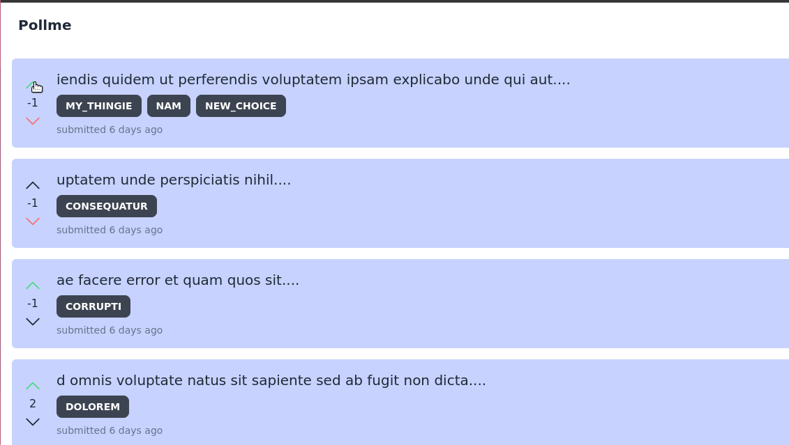

# pollme

A polling app with a svelte frontend and a rust backend.



## Starting the server

```bash
cd pollme-api
cargo run
```

## Starting the frontend

```bash
cd pollme-web
pnpm install
pnpm dev
```

### Features

A list of features that are currently implemented in the app.

- [] Create a poll
- [] Delete a poll
- [x] Vote on a poll
- [x] View results of a poll
- [x] View all polls
- [x] Login
- [x] Register
